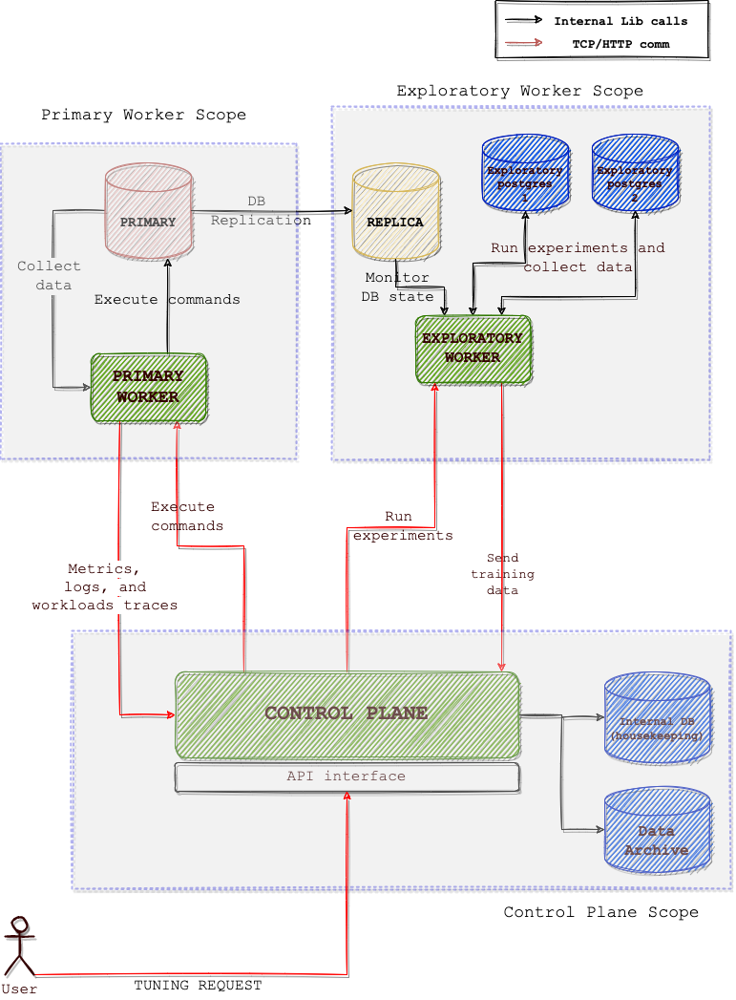

# noisepage-control
NoisePage Autonomous Control Plane Infrastructure


## Setup steps


1. Install RabbitMQ

```
sudo apt-get install wget apt-transport-https -y
wget -O- https://www.rabbitmq.com/rabbitmq-release-signing-key.asc | sudo apt-key add -
echo "deb https://dl.bintray.com/rabbitmq-erlang/debian focal erlang-22.x" | sudo tee /etc/apt/sources.list.d/rabbitmq.list
sudo apt-get install rabbitmq-server -y --fix-missing
sudo systemctl status rabbitmq-server
```

2. Install Postgres and setup DB

```
sudo apt install postgresql postgresql-contrib
sudo -u postgres -i
psql
    CREATE USER cmudb WITH superuser ENCRYPTED PASSWORD 'cmudb@2021';
    CREATE DATABASE noisepage_control WITH OWNER cmudb ENCODING 'UTF8';
```

3. Setup pipenv and install required packages

```
sudo apt-get install python3-pip
pip3 install pipenv
pipenv sync
```

4. Run the server
```
pipenv run run.sh CONTROL_PLANE|PRIMARY_WORKER|EXPLORATORY_WORKER
```


## System Architecture


